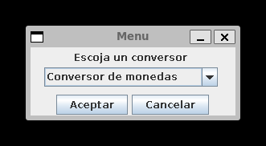
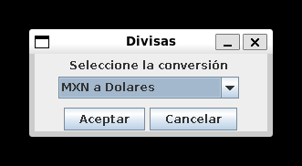
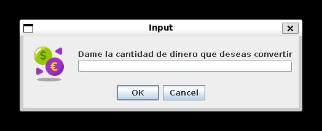
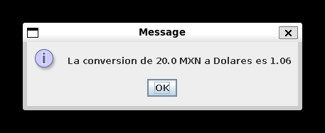

# *Alura ONE Conversor* 💱

#### Este proyecto es parte de los retos del programa Oracle Next Education (ONE) en colaboración con AluraLatam

## Requisitos del proyecto

#### Crear un conversor de divisas usando el lenguaje Java y la librería Java Swing con las siguientes características

```

- Convertir de la moneda de tu país a Dólar
- Convertir de la moneda de tu país  a Euros
- Convertir de la moneda de tu país  a Libras Esterlinas
- Convertir de la moneda de tu país  a Yen Japonés
- Convertir de la moneda de tu país  a Won sul-coreano 
```

#### ❗ En este caso la moneda de mi país es el peso mexicano

Además de que también se puede hacer la conversion de manera inversa.

```
- Convertir de Dólar a la moneda de tu país
- Convertir de Euros a la moneda de tu país
- Convertir de Libras Esterlinas a la moneda de tu país
- Convertir de Yen Japonés a la moneda de tu país
- Convertir de Won sul-coreano a la moneda de tu país
```

### Extras

#### Como desafio extra se sugiere añadir un tipo de conversor extra, puede ser de cualquier tipo

## Descripción del proyecto

#### Para la realización de este proyecto se utilizo el patron de diseño Model-View-Controller (MVC) ya que es un patron adecuado para proyectos que implementen interfaces gráficas
#### Al iniciar nos encontraremos con la siguiente interfaz donde podemos escojer entre el *Conversor de monedas* y el *Conversor de temperatura*

<br>



#### Después nos pide escojer la divisa para convertir

<br>


#### Después nos pide ingresar el monto a convertir
<br>



#### Después de ingresar el dato nos mostrará el resultado. En caso de ingresar algún dato que no sea numerico, entonces nos mostrara un mensaje de *Dato invalido* y nos volverá a pedir el dato.
<br>



## Conversor extra
#### El conversor extra se trata de un conversor de temperatura, donde se reutilizan las vistas del conversor de divisas haciendo uso del POO y haciendo un proyecto sencillo de mantener y facil de implementar features.
